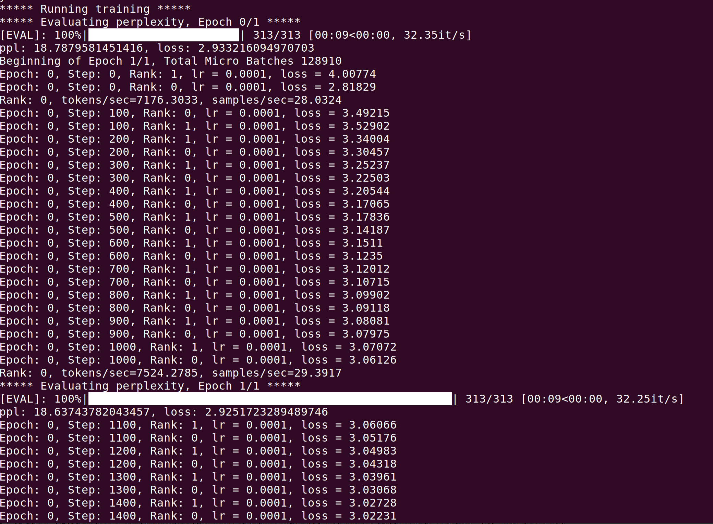
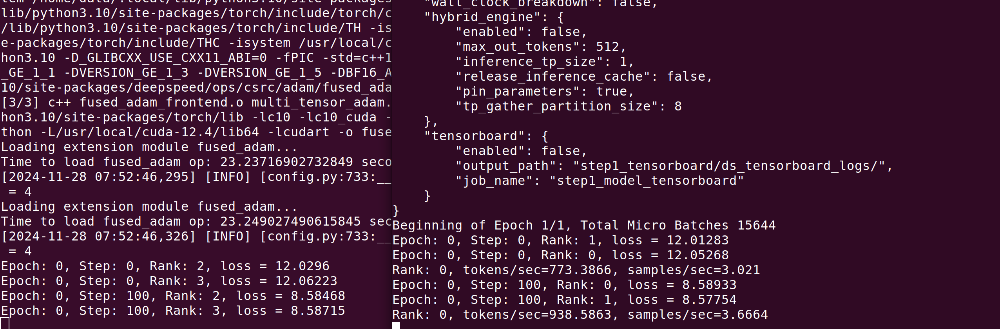

# TrainGPT
Finetune Qwen with DeepSpeed

With max_seq_len=128 and qwen2.5-0.5B-instruct as base model, you can run the code on a single RTX3060 GPU device.  
While, single node with multi GPUs or multi nodes with multi GPUs is also supported by this code.   


### TODO List
1. More Dataset and More Base Models(especially for small LLM)  
2. DPO  
3. PPO  


### Training Steps
#### step1. Prepare Dataset(lmdb cache for boosting)
```python
cd dataset & vim generate_lmdb.py   
```
the dataset: medical was downloaded from huggingface: shibing624/medical.    
if you want to use your own datasets, just modify the script: dataset/generate_lmdb.py    

```python
    dataset = MedicalMix(data=dict(
        data_paths=[
            '/data/data/llm_datasets/medical/finetune/train_zh_0.json',
            '/data/data/llm_datasets/medical/finetune/train_en_1.json',
        ]),
        tokenizer_path="/data/Qwen/Qwen2.5-0.5B-Instruct",
        proc_func=qwen2_preprocess,
        # max_dataset_len=100,
    )

    sample = dataset.__getitem__(0)
    print(sample)

    dataset.write2lmdb(lmdb_path='/data/data/llm_datasets/cache/medical_mix_finetune_train_qwen2.5_tokenized_20241216.lmdb',
                       key_tag='train_zh_and_en')
```

#### step2. Finetune Model with Instruct Dataset
setting the arguments below, and then, set up the training code.
```python
train_lmdb_path
eval_lmdb_path
tokenizer_name_or_path
model_name_or_path
```

```python
cd finetune
deepspeed finetune_qwen.py  
```

#### Finetune on a single node with 2*RTX4090      
  

#### Finetune on 2 nodes(2*RTX4090 and 2*A100), extremely slow because a 72B-awq deployed on each A100 device.   
  

#### Custom Develop

#### Package: dschat   
the package dschat was copied from microsoft/DeepSpeedExamples with nothing modified.   
the position is "DeepSpeedExamplesapplications/DeepSpeed-Chat/dschat"


### Reference   
https://github.com/microsoft/DeepSpeedExamples


